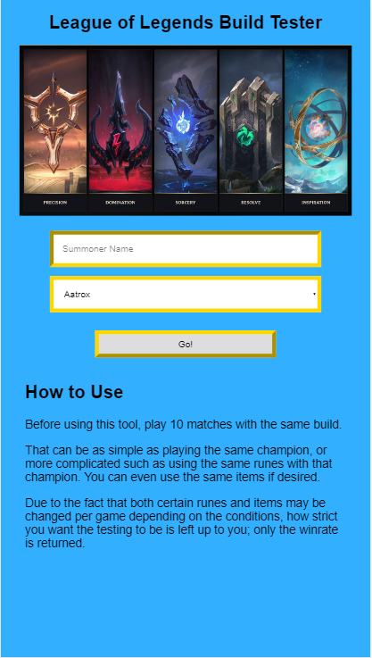
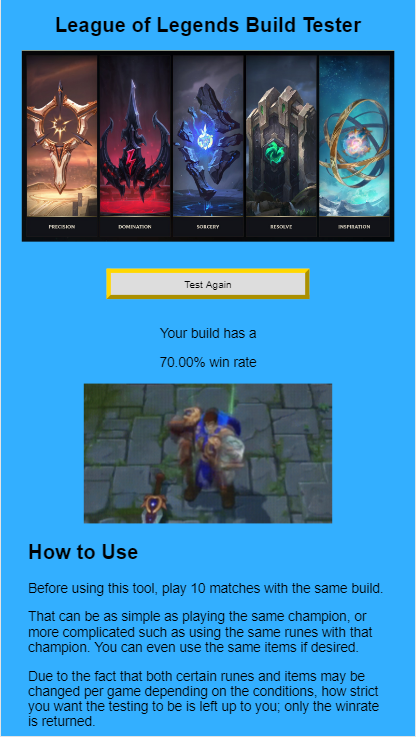
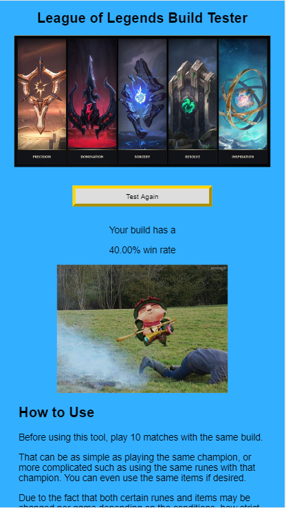

<h1>League of Legends Build Tester</h1>

Live Page: https://edwinhollenbeck.github.io/api_capstone/

<h2>Summary</h2>
A tool to test the effectiveness of League of Legends champion builds. Users enter their Summoner names and select
which champion they would like to test for and are given their win rate. Users are expected to have played a certain number of ranked matches before using the tool to generate the data, using the same runes and items every time (with minor exceptions for adaptations made in-game or during matchmaking).

<h2>Screenshots:</h2>

<h2>Built With:</h2>

HTML 
CSS 
JavaScript 
jQuery
